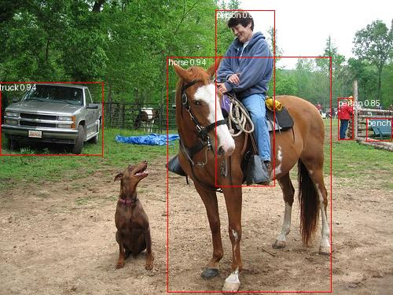

## 模型导出

```
cd rtdetr_pytorch && mkdir weights 
wget https://github.com/lyuwenyu/storage/releases/download/v0.1/rtdetr_r18vd_5x_coco_objects365_from_paddle.pth -P ./weights
python tools/export_onnx.py --config configs/rtdetr/rtdetr_r18vd_6x_coco.yml --resume weights/rtdetr_r18vd_5x_coco_objects365_from_paddle.pth --file-name weights/rtdetr_r18vd_5x_coco_objects365_from_paddle.onnx --simplify --check
python download/avgpool_optimize.py
```

在rtdetr_pytorch/src/zoo/rtdetr/rtdetr_decoder.py中进行了一些修改，保证onnx中不出现inversesigmoid且使用爱芯硬件支持的MultiScaleDeformableAttn算子

## 模型编译

```
pulsar2 build --config download/rtdetr_config.json --input rtdetr_pytorch/weights/rtdetr_r18vd_5x_coco_objects365_from_paddle_opt.onnx --output_dir build_output/rtdetr --output_name rtdetr_msda.axmodel
```

## 板上demo

将下面文件复制到板子上，并执行命令，得到输出结果
download/axmodel_inference.py
download/ssd_horse.jpg
build_output/rtdetr/rtdetr_msda.axmodel

```
python axmodel_inference.py
```

输出：

```
0.9363959 17
[0.63529414 0.5921569  0.4156863  0.7960785 ]
0.91876596 0
[0.62352943 0.33333334 0.14901961 0.59607846]
0.8507092 0
[0.87843144 0.4039216  0.03529412 0.14117648]
0.9363959 7
[0.12941177 0.4039216  0.2627451  0.24705884]
0.6992483 13
[0.96470594 0.43921572 0.0627451  0.07843138]
```

